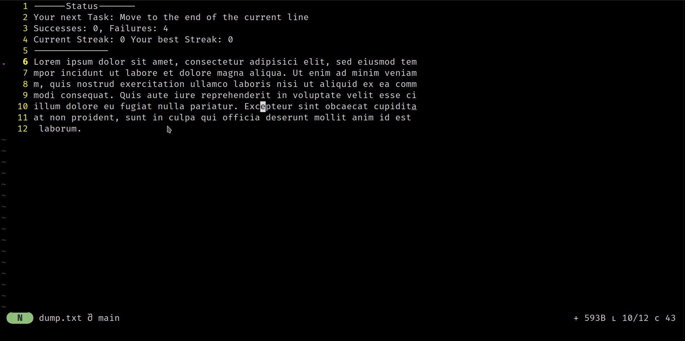

# nvim-training

[](https://opensource.org/license/gpl-3-0/)

This code implements a Neovim Plugin for training your muscle memory.

This plugin fills a gap I have noticed during interaction with vim:
Knowing is half the battle, executing another entirely.
This plugin aims to help with the latter. Basic familiarity
with vim is assumed.

A training session consists of a series of tasks, each of which is small and easily repeatable.
The plugin will recognize when a task is completed and automatically start the next one.
This helps to work on a lot of tasks in a short amount of time.

I consider this project mature enough for daily use. I will expand it as I see fit, which
might include months of inactivity. I will respond to issues quickly, including
requests for new features.

I will attempt to ship breaking changes to public interfaces in such a way that they are done "all/many at once".
I consider this to be the best option for minimizing disruptions.

# Known problems
Currently, logging and event storage for statistics is disabled. A fix/reeenabling them is
under way.

# Some stats of current tasks

- Supported Tasks: 56 (For a full list, see below)
- Supported Tasks-Collections: 5
- Supported Schedulers: 3

# In Action


# Installation

Install it using the plugin manager of your choice.
[Lazy](https://github.com/folke/lazy.nvim) is tested,
if any other fails, please open an issue. Pinning your local installation to a fixed version is encouraged.
In Lazy, a possible setup might be:

```lua
local lazy = require("lazy")
local plugin_list = {
    -- Your various other plugins ..
    {"https://github.com/Weyaaron/nvim-training", pin= true, opts = {}}
    -- Support for configuration with opts is included, see below for the options
}
lazy.setup(plugin_list)
```

# Commands
This plugin uses subcommands of `Training` to activate certain functions.
All of these commands support completion, just use `Tab` and you will be fine.
Currently, these are the available options:

| Name | Syntax | Description |
| --- | -------- | -------- |
| Start | `:Training Start [Scheduler] [Task-Collection A] [Task Collection B] ...`| Starts a session with the choosen scheduler and the choosen task collections. Both arguments are optional. |
| Stop | `:Training Stop`| Stops a session. |
| Analyze | `:Training Analyze`| Prints some statistics about your progress. |

The plugin aims to use scratch-buffers to avoid polluting the disk.

# Full Task List

<details>
<summary> Click to expand </summary>
<!-- s1 -->


# All tasks

| Name | Description | Tags | Notes
| --- | -------- | -------- | -------- |
|AppendChar | Insert a char next to the cursor. | append, change, insertion |
|BlockCommentLine | Change the current line into a block comment. | change, comment, plugin, programming | This assumes the use of a plugin, it is not tested with the buildin-commenting-feature. |
|Changef | Change text using f | chair-wise, change, f, horizontal, right |
|ChangeF | Change text using F | chair-wise, change, F, horizontal, left |
|ChangeLine | Change the current line. | change, deletion, line |
|Changet | Change text using f | chair-wise, change, horizontal, right, t |
|ChangeT | Change text using T | chair-wise, change, horizontal, left, T |
|ChangeWord | Change multiple words. | change, counter, horizontal, text-object, word |
|CommentLine | Change the current line into a single line comment. | change, commenting, plugin, programming | Not available in vanilla-vim, needs plugin. |
|DeleteChar | Delete the current char. | change, char, deletion |
|Deletef | Delete forward to the next char. | chair-wise, deletion, f, horizontal, right |
|DeleteF | Delete back to the previous char. | chair-wise, deletion, F, horizontal, left |
|DeleteInsideMatch | Delete inside the current match. | deletion, match, text-object |
|DeleteLine | Delete the current line. | deletion, line |
|DeleteSentence | Delete the textobject inner sentence. | deletion, horizontal, text-object, sentence |
|DeleteT | Delete back to the next char. | chair-wise, deletion, horizontal, left, T |
|Deletet | Delete to the next char. | chair-wise, deletion, horizontal, right, t |
|DeleteWORD | Delete multiple WORDs. | counter, deletion, horizontal, text-object, WORD |
|DeleteWord | Delete multiple words. | counter, deletion, horizontal, text-object, word |
|Increment | Increment the value at the cursor. | change, char, increment |
|InsertAtStartOfLine | Insert text at the start of the line. | I, insert, line, start |
|InsertChar | Insert a char at the current position. | change, char, insertion |
|JoinLines | Join the current line with the line below. | change, J, join, line |
|MoveAbsoluteLine | Move to the absolute line. | line, movement, vertical |
|MoveCharsLeft | Move left charwise. | char, h, horizontal, movement |
|MoveCharsRight | Move right charwise. | horizontal, l, movement |
|MoveEndOfFile | Move to the end the file. | end, file, movement, vertical |
|MoveEndOfLine | Move to the end of the current line. | end, horizontal, line, movement |
|MoveF | Go back to the last ocurrence of a char. | chair-wise, F, horizontal, left, movement |
|Movef | Find the next char. | chair-wise, f, horizontal, movement, right |
|MoveLinesDown | Move down multiple lines. | horizontal, j, lines, movement |
|MoveLinesUp | Move multiple lines up. | horizontal, k, lines, movement |
|MoveMatch | Move to the current match. | match, movement, text-object |
|Moveo | Enter and leave insert mode below the current line. | insert_mode, linewise, movement, o |
|MoveO | Enter and leave insert mode above the current line. | insert_mode, linewise, movement, O |
|MoveStartOfFile | Move to the start of the file. | file, start, vertical |
|MoveStartOfLine | Move to the start of the current line. | line, movement, start |
|MoveT | Go back next to the last ocurrence of a char. | chair-wise, horizontal, left, movement, T |
|Movet | Move using t. | chair-wise, horizontal, movement, right, t |
|MoveWord | Move multiple words. | counter, horizontal, movement, text-object, word |
|MoveWORD | Move multiple WORDS. | counter, horizontal, movement, text-object, WORD |
|MoveWordEnd | Move to the end of words. | end, movement, vertical, word |
|MoveWORDEnd | Move to the end of WORDs. | end, movement, vertical, WORD |
|MoveWORDStart | Move Back to the start of 'WORDS'. | horizontal, movement, word |
|MoveWordStart | Move back to the start of 'words'. | horizontal, movement, word |
|paste | Paste from a given register. | paste, register |
|Paste | Paste from a given register. | Paste, register |
|SearchBackward | Search backwards. | diagonal, movement, search |
|SearchForward | Search forwards. | forward, movement, search |
|SearchWordBackward | Search backwards for the word at the cursor. | backward, movement, search |
|SearchWordForward | Search forwards for the word at the cursor. | forward, movement, search |
|YankEndOfLine | Yank to the end of the current line. | end, line, yank |
|Yankf | Yank to the next char. | chair-wise, f, horizontal, register, right, yank |
|YankF | Yank back to the previous char. | chair-wise, F, horizontal, left, register, yank |
|YankInsideBlock | Yank inside the block. | inside, register, text-object, yank |
|YankInsideMatch | Yank inside the current match. | inside, match, yank |
|YankLine | Yank a line into a register. | copy, line, register, vertical, yank |
|Yankt | Yank next to the next char. | chair-wise, horizontal, register, right, t, yank |
|YankT | Yank back next to the previous char. | chair-wise, horizontal, left, register, T, yank |
|YankWord | Yank multiple words. | counter, horizontal, register, text-object, word, yank |
|YankWORD | Yank multiple WORDS. | counter, horizontal, register, text-object, WORD, yank |

<!-- e1 -->
</details>

# Task-Collections
<!-- s2 -->
| Name | Description | Details
| ----------- | -------- | -------- |
| All | All currently supported tasks| [All](/docs/collections/All.md)
| Change | Tasks involving some change to the buffer.| [Change](/docs/collections/Change.md)
| Deletion | Tasks involving deletion| [Deletion](/docs/collections/Deletion.md)
| F | Tasks involving F| [F](/docs/collections/F.md)
| Movement | Tasks involving movements.| [Movement](/docs/collections/Movement.md)
| Register-Tasks | Tasks that may use registers| [Register-Tasks](/docs/collections/Register-Tasks.md)
| Search | Tasks involving search| [Search](/docs/collections/Search.md)
| T | Tasks involving T| [T](/docs/collections/T.md)
| WORD | WORD-based Tasks| [WORD](/docs/collections/WORD.md)
| Word | Word-based Tasks| [Word](/docs/collections/Word.md)
| Yanking | Tasks involving yanking| [Yanking](/docs/collections/Yanking.md)
| f | Tasks involving f| [f](/docs/collections/f.md)
| t | Tasks involving t| [t](/docs/collections/t.md)

<!-- e2 -->
# Schedulers

| Name | Description | Supported Arguments |
| ----------- | -------- | ---- |
| RandomScheduler | The next task is chosen at random. | - |
| RepeatUntilNSuccessScheduler | The current task is repeated until n successes are reached. | repetitions|
| RepeatNScheduler | A task is repeated n-times. | repetitions |

# Configuration
A interface for configuration is provided. These are the default values.
Simply copying then but leaving the defaults in is actually discouraged. Some of these names
might change, and if you leave this in your config these changes are not propagated.
```lua
local training = require("nvim-training")
training.configure({ -- All of these options work for 'opts' of lazy as well.
	audio_feedback = true, -- Enables/Disables audio feedback, if enabled, requires the 'sox' package providing the 'play' command.
	counter_bounds = { 1, 5 }, --The outer bounds for counters used in some tasks. WARNING: A high value may result in glitchy behaviour.
	custom_collections = {}, -- A table of tables containing names of tasks, for details read on.
	disabled_tags = { "treesitter" }, -- A table of tags that are not enabled by default. For reasons see below.
	disabled_collections = { "Treesitter-Tasks" }, -- A table of collections that are not enabled by default. For reasons see below.
	enable_counters = true, -- Enables/Disables counters in tasks that support counters.
	enable_events = true, -- Enables/Disables events.
	enable_registers = false, -- Enables/Disables registers. Since this option complicates a lot of tasks, it is disabled by default.
	enable_repeat_on_failure = false, -- Enables/Disables wether the current task will be repeated (exactly) if it failed. Failures will be counted regardless.
	enable_highlights = true, --Enables/Disables highlights. Care is taken to ensure that tasks are possible without them.
	event_storage_directory_path= vim.fn.stdpath("data") .. "/nvim-training/", -- The path used to store events.
	logging_args = {
        enable_logging = true, --Enables/Disables logging entirely.
		log_directory_path = vim.fn.stdpath("log") .. "/nvim-training/",
		log_file_path = os.date("%Y-%m-%d") .. ".log",
		display_logs = false, --Enables/Disables wether messages with the level 'log' should be printed. WARNING: Enabling his produces a lot of noise, but might be usefull for developers.
		display_warnings = true, --Enables/Disables wether messages with the level 'warning' should be printed.
	},
	possible_marks_list = { "a", "b", "c", "r", "s", "t", "d", "n", "e" }, -- A list of possible marks.
	possible_register_list = { "a", "b", "c", "r", "s", "t", "d", "n", "e" }, -- A list of possible registers.
	scheduler_args = { repetitions = 5 }, --These args are used to configure all the available schedulers
	task_alphabet = "ABCDEFGabddefg,.", -- The alphabet of targets used in tasks like f,t etc.
})
```

## Custom Collections
To add a custom collection, please use its name as a key for a list of task names in the config, for example like this:

```lua
local training = require("nvim-training")
training.configure({
    -- .. your other configs ...
	custom_collections = { MyCollection = { "MoveWord", "MoveWORD"}}
})
```
You may provide as many collections as you wish, they will be available in autocompletion.

# Goals
- Ease of use. Starting a session should be seamless. The UI should not get in the way.
- Fast and flow-inducing. There should be no waiting time/friction between tasks.
- (Eventually) Community-driven. Adding new tasks is encouraged, both by providing the interfaces and the documentation required.
- Customizable. Task should be switched on and off with ease, and the difficulty should be adjustable.

# Non-Goals
- Implement puzzles. A solution to the current task should be obvious and small, at most a few keystrokes on a vanilla setup.
- Competing with others. Your progress matters to you, not to others.
- Provide help/guides on how to solve a particular task. Basic familiarity with vim is assumed.
- Constrain the user on how to solve a particular task.
- Support for everyones personal setup. Some settings may mess up some tasks, support for these cases is limited. I try to accomodate about 80% of the users and
will decide each upcoming case on its own.

# On Contributions
Contributions are welcome! Any input is appreciated, be it a bug report, a feature request, or a pull request.
Just open a issue and we shall get cooking :)

# [License](/LICENSE)
[GPL](LICENSE)
